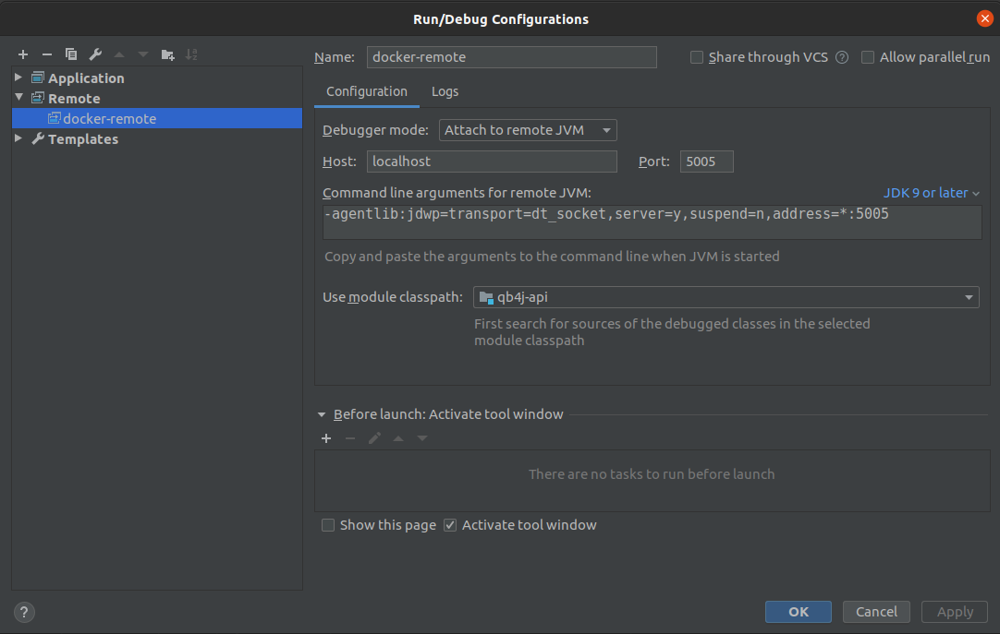

[](https://travis-ci.com/jones-chris/qb4j-api)

# qb (Query Builder)

## About 
qb stands for Query Builder.

Catchy acronyms for `qb` might be "cubey".  Being that this is a software project, this project gets marketing points 
if it's name or logo pays homage to the cube/hexagon.

`qb` seeks to provide a query builder GUI (graphical user interface) "web plug-in" to allow users to create, execute, and share 
SQL SELECT queries.  To do this, `qb` is a docker image that, when run as a container, runs a Spring Boot REST API that 
also serves a React front end.   

qb's purpose is to read a target database(s) metadata and data and serve it up through a REST API.  In addition, it
can consume, validate, and run a JSON-serialized `SQL SELECT` statement and pass the query results back
to the GUI.  

The GUI is intended to be an `iframe` embedded in an application.  When the GUI receives query results
from the REST API, it will post a message to the parent window, which allows the parent window to 
consume, analyze, and visualize the data to its users as it sees fit.

#### What databases does qb support?

Currently, `qb` has passed tests to read and query the following databases:

- PostgreSQL
- MySQL
- SQLite

The following databases are planned to be supported in the future:

- Oracle
- SQL Server 

## Use 

#### Introductory Tutorial

Follow these steps to run `qb` on your local machine:

1. Pull the latest `qb` image: 

    `docker pull joneschris/qb:latest`

2. Pull the latest PostgreSQL image so you have a database running that `qb` can interact with: 

    `docker pull postgres`

3. Start a PostgreSQL container:  
    
    `docker run --name some-postgres -e POSTGRES_PASSWORD=mysecretpassword -d postgres`

4. Create a `YAML` configuration file for `qb`:  

    `touch qb.yml`

5. Copy and paste the `YAML` below into the file: 

    ```yaml
    targetDataSources:
      - name: my_database
        url: jdbc:postgresql://localhost:5432/postgres
        databaseType: PostgreSQL
        username: postgres
        password: mysecretpassword
        excludeObjects:
          schemas: []
          tables: []
          columns: []
    
    databaseMetadataCacheSource:
      cacheType: IN_MEMORY
    
    queryTemplateDataSource:
      repositoryType: IN_MEMORY
    ```

6. Assign the file contents to the `QB_CONFIG` shell variable: 

    `export QB_CONFIG=$(cat ./qb.yml)`

7. Start a `qb` container with 

    `docker container run --publish 8080:8080 --detach --env qb_config="$QB_CONFIG" joneschris/qb:latest`
    
8. Open your Chrome browser and go to `http://localhost:8080`.  You should see the React front end / GUI.  Please note that if you run a query, open your browser's developer tools and look at the console to see the query results.


#### Configuration

`qb` relies on a `YAML` file to give it context (ie: to make it aware) of:
 
1) The databases you want it to read and query (known as `target data sources`).

2) The location of the cache of database metadata (the cache serves database metadata to qb so that qb does not 
have to query the databases constantly for the metadata).

3) The location of the database that it can read and write JSON-serialized SQL SELECT queries in order for users to save 
their queries.

The example `YAML` file looks like this:

    targetDataSources:
      - name: my_database
        url: jdbc:postgresql://localhost:5432/postgres
        databaseType: [MySql | Oracle | PostgreSQL | Sqlite | SqlServer]
        username: postgres
        password: mysecretpassword
        excludeObjects:
          schemas: [
            schema_a,
            schema_b
          ]
          tables: [
            schema_c.table_a,
            schema_c.table_b
          ]
          columns: [
            schema_d.table_c.column_a,
            schema_d.table_c.column_b
          ]
    
    databaseMetadataCacheSource:
      cacheType: [IN_MEMORY | REDIS]
      host: localhost (can be ommited if cacheType is IN_MEMORY; required if cacheType is REDIS)
      port: 6379 (can be ommited if cacheType is IN_MEMORY; required if cacheType is REDIS)
      username: my_username (can be ommited if cacheType is IN_MEMORY; optional if cacheType is REDIS)
      password: my_password (can be ommited if cacheType is IN_MEMORY; optional if cacheType is REDIS)
    
    queryTemplateDataSource:
      repositoryType: [IN_MEMORY | SQL_DATABASE]
      url: jdbc:mysql://127.0.0.1:3306/qb (can be ommited if repositoryType is IN_MEMORY; required if repositoryType is SQL_DATABASE)
      databaseType: [MySql | Oracle | PostgreSQL | Sqlite | SqlServer] (can be ommited if repositoryType is IN_MEMORY; required if repositoryType is SQL_DATABASE)
      username: root (can be ommited if repositoryType is IN_MEMORY; required if repositoryType is SQL_DATABASE)
      password: password (can be ommited if repositoryType is IN_MEMORY; required if repositoryType is SQL_DATABASE)

## Database Metadata Caching
`qb` uses target database metadata such as schema names, table and view names, and column data types to serve this data
to clients, validate JSON-serialized SQL SELECT statements, and build a SQL SELECT statement from the JSON-serialized SQL 
SELECT statement that can be run against the target database. 

If `qb` queried the target database for this metadata every time a client requested metadata or it needed to validate a
JSON-serialized SQL SELECT statement, or build a SQL SELECT statement from a JSON-serialized SQL SELECT statement, it could 
affect the target database's performance.  To avoid this, when qb starts, it will query the target database for metadata
and write the metadata to either an in-memory `HashMap` or a Redis cache.  Read below to understand each option.

### In memory Cache
An in-memory cache is best suited for development, small target databases, or when running only 1 Docker container in
a container orchestration platform.

To enable in-memory caching, change the `databaseMetadataCacheSource.cacheType` value to `IN_MEMORY` (it is case-sensitive):

```yaml
targetDataSources:
  - name: my_database
    url: jdbc:postgresql://localhost:5432/postgres
    databaseType: PostgreSQL
    username: postgres
    password: mysecretpassword
    excludeObjects:
      schemas: []
      tables: []
      columns: []

databaseMetadataCacheSource:
  cacheType: IN_MEMORY # <---- This is an in-memory cache.

queryTemplateDataSource:
  url: jdbc:mysql://127.0.0.1:3306/qb
  databaseType: MySql
  username: root
  password: password
```

`qb` will refresh the in-memory cache every 24 hours after it starts.

***NOTE:  There are plans to add an API endpoint that will refresh the cache, so that this can be done on-demand.

### Redis Cache
A Redis cache is best suited for production or large target databases.

To enable Redis caching, change the `databaseMetadataCacheSource.cacheType` value to `REDIS` (it is case-sensitive):

```yaml
targetDataSources:
  - name: my_database
    url: jdbc:postgresql://localhost:5432/postgres
    databaseType: PostgreSQL
    username: postgres
    password: mysecretpassword
    excludeObjects:
      schemas: []
      tables: []
      columns: []

databaseMetadataCacheSource:
  cacheType: REDIS # <---- This is a Redis cache.
  host: localhost  # <---- The Redis cache host.
  port: 6379       # <---- The Redis cache port.
  username: my_username # <---- The redis username.
  password: my_password # <---- The redis password.

queryTemplateDataSource:
  repositoryType: SQL_DATABASE
  url: jdbc:mysql://127.0.0.1:3306/qb
  databaseType: [MySql | Oracle | PostgreSQL | Sqlite | SqlServer]
  username: root
  password: password
```

#### Running qb to Update a Redis Cache
Because a Redis cache could be used by multiple `qb` instances or other applications, `qb` does **NOT** populate 
the Redis cache with database metadata on start up, unlike an in-memory cache.  

To populate the Redis cache, you can run `qb` in `Update Cache` mode by doing the following:
```shell script
docker run --env qb_config="$QB_CONFIG" --env update_cache=true joneschris/qb:latest
```

When the `update_cache` environment variable is set to `true` (the default is `false` if not specified), the `qb` container
will read target database metadata and write it to the Redis cache specified in the `qb.yml` file and then exit.  This 
allows you to set up a scheduled task to initially populate and refresh the Redis cache.

## Query Template Persistence

`qb` allows users to save their queries so that they can execute them in the future without having to rebuild them and so 
that they and other users can use them as sub queries when building other queries.  

The `queryTemplateDataSource` `YAML` property is where you specify where `qb` should store users' queries (aka: query templates).  
There are 2 options for storing queries:  

1) `IN_MEMORY`: An ephemeral in-memory data structure meant only for development purposes.

2) `SQL_DATABASE`: A SQL database meant for non-development purposes.  When you choose this option, run the DDL script 
at `./data/sql/query_templates/schema.{your database type}.sql` to create the necessary schema that `qb` expects when saving 
and retrieving queries.

No other `queryTemplateDataSource` `YAML` properties are needed if the `repositoryType` is `IN_MEMORY`.  If the `repositoryType` 
is `SQL_DATABASE`, then `url`, `databaseType`, `username`, and `password` are required.

## Local Development

#### Compile and Run the API
To compile the API into a JAR, build a docker image with the JAR in it, and run the API locally run the following command from the project root 
directory:

1) `cd` to the root of this project.

2) Run the `run-locally.sh` script:

    ```shell script
    ./run-locally.sh
    ```
   
To attach the IntelliJ Remote Debugger, do the following:

1) Set up an IntelliJ Remote Debugger Configuration like so (these should be the default Remote settings): 

2) Run the IntelliJ Remote Debugger Configuration by clicking on the green Debug icon:  
