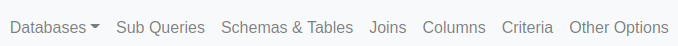
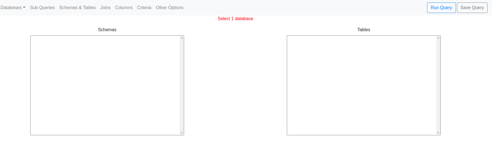
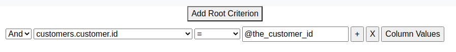

[](https://travis-ci.com/jones-chris/qb)
[](https://codecov.io/gh/jones-chris/qb)

# qb (Query Builder)

## About 
`qb` stands for Query Builder.

`qb` provides a query builder GUI (graphical user interface) that is designed to be embedded in other applications ([a web app](http://querybuilder4j.net/web-app/index.html), [Tableau](http://querybuilder4j.net/tableau/web-data-connector/qb4j.html), Excel, etc) to allow users to create, execute, and share SQL SELECT queries.  

To do this, `qb` is a docker image that, when run as a container, runs a Spring Boot REST API that also serves a React front end / UI.    

#### What databases does qb support?

Currently, `qb` has been successfully tested with the following databases:

- PostgreSQL (Redshift may work since it's based on PostgreSQL)
- MySQL
- SQLite

The following databases are planned to be supported in the future:

- Oracle
- SQL Server 

## Back End Usage 

#### Introductory Tutorial

Follow these steps to run `qb` on your local machine:

1. Pull the latest `qb` image: 

    `docker pull joneschris/qb:latest`

2. Pull the latest PostgreSQL image so you have a database running that `qb` can interact with: 

    `docker pull postgres`

3. Start a PostgreSQL container:  
    
    `docker run --name some-postgres -e POSTGRES_PASSWORD=mysecretpassword -d postgres`

4. Create a `YAML` configuration file for `qb`:  

    `touch qb.yml`

5. Copy and paste the `YAML` below into the file: 

    ```yaml
    targetDataSources:
      - name: my_database
        url: jdbc:postgresql://localhost:5432/postgres
        databaseType: PostgreSQL
        username: postgres
        password: mysecretpassword
        excludeObjects:
          schemas: []
          tables: []
          columns: []
    
    databaseMetadataCacheSource:
      cacheType: IN_MEMORY
    
    queryTemplateDataSource:
      repositoryType: IN_MEMORY
    ```

6. Assign the file contents to the `QB_CONFIG` shell variable: 

    `export QB_CONFIG=$(cat ./qb.yml)`

7. Start a `qb` container with 

    `docker container run --publish 8080:8080 --detach --env qb_config="$QB_CONFIG" joneschris/qb:latest`
    
8. Open your Chrome browser and go to `http://localhost:8080`.  You should see the React front end / GUI.  Please note that if you run a query, open your browser's developer tools and look at the console to see the query results.


#### Configuration

`qb` relies on a `YAML` file to give it context (ie: to make it aware) of:
 
1) The databases you want it to read and query (known as `target data sources`).

2) The location of the cache of database metadata (the cache serves database metadata to qb so that qb does not 
have to query the databases constantly for the metadata).

3) The location of the database that it can read and write JSON-serialized SQL SELECT queries in order for users to save 
their queries.

The example `YAML` file looks like this:

```yaml
    targetDataSources:
      - name: my_database
        url: jdbc:postgresql://localhost:5432/postgres
        databaseType: [MySql | Oracle | PostgreSQL | Sqlite | SqlServer]
        username: postgres
        password: mysecretpassword
        excludeObjects:
          schemas: [
            schema_a,
            schema_b
          ]
          tables: [
            schema_c.table_a,
            schema_c.table_b
          ]
          columns: [
            schema_d.table_c.column_a,
            schema_d.table_c.column_b
          ]

    databaseMetadataCacheSource:
      cacheType: [IN_MEMORY | REDIS]
      host: localhost (can be ommited if cacheType is IN_MEMORY; required if cacheType is REDIS)
      port: 6379 (can be ommited if cacheType is IN_MEMORY; required if cacheType is REDIS)
      username: my_username (can be ommited if cacheType is IN_MEMORY; optional if cacheType is REDIS)
      password: my_password (can be ommited if cacheType is IN_MEMORY; optional if cacheType is REDIS)

    queryTemplateDataSource:
      repositoryType: [IN_MEMORY | SQL_DATABASE]
      url: jdbc:mysql://127.0.0.1:3306/qb (can be ommited if repositoryType is IN_MEMORY; required if repositoryType is SQL_DATABASE)
      databaseType: [MySql | Oracle | PostgreSQL | Sqlite | SqlServer] (can be ommited if repositoryType is IN_MEMORY; required if repositoryType is SQL_DATABASE)
      username: root (can be ommited if repositoryType is IN_MEMORY; required if repositoryType is SQL_DATABASE)
      password: password (can be ommited if repositoryType is IN_MEMORY; required if repositoryType is SQL_DATABASE)
```

### Database Metadata Caching
`qb` uses target database metadata such as schema names, table and view names, and column data types to serve this data
to clients, validate JSON-serialized SQL SELECT statements, and build a SQL SELECT statement from the JSON-serialized SQL 
SELECT statement that can be run against the target database. 

If `qb` queried the target database for this metadata every time a client requested metadata or it needed to validate a
JSON-serialized SQL SELECT statement, or build a SQL SELECT statement from a JSON-serialized SQL SELECT statement, it could 
affect the target database's performance.  To avoid this, when qb starts, it will query the target database for metadata
and write the metadata to either an in-memory `HashMap` or a Redis cache.  Read below to understand each option.

It's important to note that each `targetDataSource` is not required to be a database.  You are free to define a `targetDataSource` as any number of schemas or tables within a single database.  In addition, you can have these different schemas and tables running in different instances of `qb` behind different URLs, such as `https://my.domain.com/finance` or `https://my.domain.com/hr`.  Therefore, if you have a large database with large amounts of metadata to cache, you can partition the database using one or both of these strategies so that the cache is smaller and more performant.

#### In memory Cache
An in-memory cache is best suited for development, small target databases, or when running only 1 Docker container in
a container orchestration platform.

To enable in-memory caching, change the `databaseMetadataCacheSource.cacheType` value to `IN_MEMORY` (it is case-sensitive):

```yaml
targetDataSources:
  - name: my_database
    url: jdbc:postgresql://localhost:5432/postgres
    databaseType: PostgreSQL
    username: postgres
    password: mysecretpassword
    excludeObjects:
      schemas: []
      tables: []
      columns: []

databaseMetadataCacheSource:
  cacheType: IN_MEMORY # <---- This is an in-memory cache.

queryTemplateDataSource:
  url: jdbc:mysql://127.0.0.1:3306/qb
  databaseType: MySql
  username: root
  password: password
```

`qb` will refresh the in-memory cache every 24 hours after it starts.

***NOTE:  There are plans to add an API endpoint that will refresh the cache, so that this can be done on-demand.

#### Redis Cache
A Redis cache is best suited for production or large target databases.

To enable Redis caching, change the `databaseMetadataCacheSource.cacheType` value to `REDIS` (it is case-sensitive):

```yaml
targetDataSources:
  - name: my_database
    url: jdbc:postgresql://localhost:5432/postgres
    databaseType: PostgreSQL
    username: postgres
    password: mysecretpassword
    excludeObjects:
      schemas: []
      tables: []
      columns: []

databaseMetadataCacheSource:
  cacheType: REDIS # <---- This is a Redis cache.
  host: localhost  # <---- The Redis cache host.
  port: 6379       # <---- The Redis cache port.
  username: my_username # <---- The redis username.
  password: my_password # <---- The redis password.

queryTemplateDataSource:
  repositoryType: SQL_DATABASE
  url: jdbc:mysql://127.0.0.1:3306/qb
  databaseType: [MySql | Oracle | PostgreSQL | Sqlite | SqlServer]
  username: root
  password: password
```

#### Running qb to Update a Redis Cache
Because a Redis cache could be used by multiple `qb` instances or other applications, `qb` does **NOT** populate 
the Redis cache with database metadata on start up, unlike an in-memory cache.  

To populate the Redis cache, you can run `qb` in `Update Cache` mode by doing the following:
```shell script
docker run --env qb_config="$QB_CONFIG" --env update_cache=true joneschris/qb:latest
```

When the `update_cache` environment variable is set to `true` (the default is `false` if not specified), the `qb` container
will read target database metadata and write it to the Redis cache specified in the `qb.yml` file and then exit.  This 
allows you to set up a scheduled task to initially populate and refresh the Redis cache.

### Query Template Persistence

`qb` allows users to save their queries so that they can execute them in the future without having to rebuild them and so 
that they and other users can use them as sub queries when building other queries.  

The `queryTemplateDataSource` `YAML` property is where you specify where `qb` should store users' queries (aka: query templates).  
There are 2 options for storing queries:  

1) `IN_MEMORY`: An ephemeral in-memory data structure meant only for development purposes.

2) `SQL_DATABASE`: A SQL database meant for non-development purposes.  When you choose this option, run the DDL script 
at `./data/sql/query_templates/schema.{your database type}.sql` to create the necessary schema that `qb` expects when saving 
and retrieving queries.

No other `queryTemplateDataSource` `YAML` properties are needed if the `repositoryType` is `IN_MEMORY`.  If the `repositoryType` 
is `SQL_DATABASE`, then `url`, `databaseType`, `username`, and `password` are required.

## Front End / UI Usage 

### Menu Bar Overview

If you are familiar with the syntax of a `SQL SELECT` statement, then the `qb` UI will look familiar.  The UI has 7 tabs
in the menu bar at the top of the page.  



Most SQL databases have schemas, which contain tables, which contain columns. 

The tabs try to follow this pattern from left to right:

- `Databases`: A drop down of the databases that the user can query.
- `Sub Queries`: An accordian-style page that users can use to write Common Table Expressions (CTEs) that are eligible to be used in the `Criteria` tab as sub queries.
- `Schemas & Tables`: Displays 2 select boxes of the selected database's schemas and tables.
- `Joins`: If the user selects multiple tables from `Schemas & Tables`, then the tables' join relationships are defined here.
- `Columns`: Displays 2 select boxes of the selected tables' columns.

The remaining 2 tabs, `Criteria` and `Other Options` are more complex:

- `Criteria`: Allows the user to filter data using nested matching criteria.  In SQL, each criterion is a `WHERE` clause.  Criteria 
can be nested as deep as the user desires.
- `Other Options`: This is a miscellaneous catch-all tab for various other options such as limiting the rows returned in the query
result, choosing only distinct / unique records, suppressing records that have null for selected columns' value, etc.

### Query Guidance Messaging

After each user action, the UI will run validation rules and display a message to the user in an effort to assist them in 
writing a correct query.   

These Query Guidance Messages can be seen just below the menu bar and are in red text.  For instance, when a user arrives 
at the UI home page, they will see a Query Guidance Message instructing them to `Select 1 database`:

  

These Query Guidance Messages must be resolved before the user can run their query.  However, a user does not need to resolve 
these Query Guidance Messages in order to save a query, thus allowing users to save queries as works-in-progress.

The Query Guidance Messages are intended to be living, interactive documentation to help the users unfamiliear with SQL build 
queries.

### Advanced UI Features

Below are advanced UI features: 

#### Query Parameters

Users can parameterize their queries by prefixing a `@` in front of some text in a criterion's filter text box (think `p@r@meter`).  



In the example below, we create a parameterized query that gets a customer's name given a parameter that we name `the_customer_id`
that will be the customer id:

https://user-images.githubusercontent.com/21240865/124415700-64d1d880-dd23-11eb-9d8f-e2d11a29f777.mp4

Continue reading the Saving Queries section to understand how the query parameter will be saved with the query.

#### Saving Queries

When the user saves the query, a query parameter with the name `the_customer_id` will be displayed:

https://user-images.githubusercontent.com/21240865/124415792-8fbc2c80-dd23-11eb-8a7e-f9cadeb35606.mp4

When saving a query, a user has 3 fields to complete:

- `Name`: The name of the query.
- `Discoverable`: `Yes` if other users can find and use this query.  Otherwise, `No`.
- `Description`: An optional free-hand text that describes what this query does.

In addition, the Parameters section is not editable, but contains the following information about each parameter in the query:

- `Parameter`:  The query parameter name (the text that is prefixed with `@` in a criterion's filter text box).
- `Allows Multiple Values`: `true` if multiple values can be passed into the parameter (`1, 2, 3` or `"bob", "sam", "joe"`).  This is `true` if the criterion's operator is `IN` or `NOT IN`.  This is `false` if only a single value can be passed into the parameter (`1` or `"bob"`).  
- `Data Type`:  The data type of the parameter.

As detailed in the next section on Sub Queries below, other users can then incorporate this query into their own query 
and pass a value in for the parameter `the_customer_id`.

#### Sub Queries

Users can use other users' queries in their own queries by "importing" them as sub queries.  Similar to how the `@` prefix 
denotes a query parameter, a `$` prefix denotes a sub query (think `$ub query`).

Picking up where the Saving Queries section above left off, a user can "import" or use the `getCustomerName` query in another query:

https://user-images.githubusercontent.com/21240865/124415811-98146780-dd23-11eb-9882-f515f3d10297.mp4

As you can see at the end of the video above, `qb` logs the API response to the browser's console, which contains the generated SQL.  You
can see that the SQL includes a Common Table Expression (or CTE) with the name of `theCustomerName`, which is used in the 
SQL's `WHERE` clause as a sub query.

### Embedding `qb` in an Application

`qb` is intended to be embedded in other applications so that users can query databases through the application of their choice 
(ex:  Tableau, Excel, ServiceNow, Business Objects, etc) and share/reuse queries across these applications.  

The video above shows that `qb` logs the API response to the browser's console, but it does not show that the same API response
is posted as a message to `qb`'s parent window, which would be the application it's embedded in.  The application that `qb` is embedded in
needs to have logic to handle this message.  This logic will differ depending on the application that `qb` is embedded in and
how the message's data will be handled.

Below are some examples of how to write this logic/code when embedding `qb` in different applications. 

[Web App Example](./src/main/ui/examples/web-app/web-app.html)

[Tableau Web Data Connector Example](./src/main/ui/examples/tableau-web-data-connector)

## Local Development

#### Compile and Run the API
To compile `qb` into a JAR, build a docker image with the JAR in it, and run `qb` locally, do the following:

1) `cd` to the root of this project.

2) Run the `run-locally.sh` script:

    ```shell script
    ./run-locally.sh
    ```
   
To attach the IntelliJ Remote Debugger, do the following:

1) Set up an IntelliJ Remote Debugger Configuration like so (these should be the default Remote settings): 

2) Run the IntelliJ Remote Debugger Configuration by clicking on the green Debug icon:  
