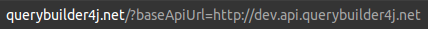
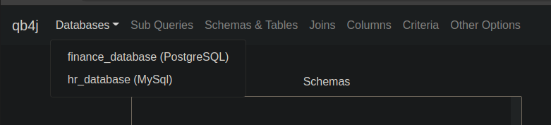

# qb4j-ui 

## About 
qb4j-ui stands for QueryBuilder4Java-User Interface.

Catchy acronyms for `qb4j` might be "Cube Forge" or "Cubey" if we further abbreviate `qb4j` to `qb`.  Being that this is 
a software project, this project gets marketing points if it's name or logo pays homage to the cube/hexagon...

qb4j-ui is the front-end of a larger project that seeks to provide a query builder GUI (graphical user interface)
"web plug-in" to allow users to create, run, and share SQL SELECT queries. The REST API back end is the [qb4j-api](https://github.com/jones-chris/qb4j-api) 
project.

qb4j-ui's purpose is to retrieve a target database's metadata and data and present it to a user who is desires to query
the database's data, but does not have the knowledge or time to learn how to write a `SQL SELECT` statement.  qb4j-ui is 
intended to be an `iframe` embedded in an application.  When the GUI receives query results from qb4j-api, it will post 
a message to the encapsulating application, which allows the encapsulating application to consume, analyze, and visualize 
the data to its users as it sees fit.

## Developer Usage 
The qb4j-ui assets (JavaScript, CSS, and HTML files as well as images) are contained in the `querybuilder4j.net` S3 bucket,
which is a public bucket for anyone to pull the assets.  In addition, the assets can be served up by going to `www.querybuilder4j.net`.

Follow these steps to integrate qb4j-ui with qb4j-api:

- Assuming you have a qb4j-api instance running (if not, see [here](https://github.com/jones-chris/qb4j-api#use-) for instructions 
on how to do so), open a browser and go to `www.querybuilder4j.net?baseApiUrl=<your qb4j-api base URL here>`, with the value 
of `baseApiUrl` being your qb4j-api domain.  For example, `http://querybuilder4j.net/?baseApiUrl=http://dev.api.querybuilder4j.net`,
like so:

- You should see the target databases that your qb4j-api instance serves under `Databases`, like in the screenshot below.
If you see your databases, then you have proven that qb4j-ui can communicate with the qb4j-api instance.

  

- You now need to write a front end application that wraps the qb4j-ui above in an `iframe`.  Your user needs will determine 
how you do this, so I'm afraid I can't write that for you :).  However, please see the `/examples` directory for various 
kinds of front end applications that can wrap qb4j-ui in an `iframe`.  The directory includes a web app example currently. 
A Tableau Web Data Connector example and Excel Office Add-In example are planned for the future.

## User Usage 

## Deployment (A Note to Myself)
The cloudformation template in the `/cloudformation` directory can be used to create the following resources:
1. The `querybuilder4j.net` S3 bucket that hosts this project's React build files as a static website.
2. The `www.querybuilder4j.net` S3 bucket that redirects traffic to the `querybuilder4j.net` S3 bucket.
3. A bucket policy for the `querybuilder4j.net` and `www.querybuilder4j.net` S3 buckets to allow public read access.
4. A Route53 hosted zone for the `querybuilder4j.net` registered domain.
5. 2 Route53 Alias record sets to direct traffic for the `querybuilder4j.net` domain to the `querybuilder4j.net` S3 bucket
   and for the `www.querybuilder4j.net` domain to the `www.querybuilder4j.net` S3 bucket.
   
In the future, integrate GitHub Actions to build the React project with `npm build` and deploy the `/cloudformation/cloudformation.yaml`
file to AWS and load the React build files into the `querybuilder4j.net` S3 bucket with `aws s3 cp -r ./build s3://querybuilder4j.net`,
